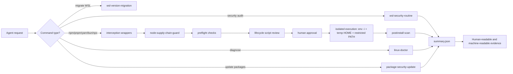

# Agentic Linux WSL Kit

[](#)
[](#supported-platforms)
[](#safety-model)
[](LICENSE)

**Safe-by-default Linux/WSL operations for LLM coding agents.**

Agentic Linux WSL Kit is an open-source skill pack and enforcement toolkit for running AI coding agents inside Linux/WSL without letting them guess, mutate, or install risky packages blindly. It combines agent-readable `SKILL.md` playbooks with deterministic shell scripts for diagnostics, safe updates, WSL migration, read-only security audits, and active package-operation defense.

It is built for agent workflows such as OpenCode, Claude Code, Codex-style agents, and other tools that can follow reusable skills and execute local scripts.

> Current state: **MVP1-MVP5 complete and publish-ready.** Default behavior is read-only, preview-first, or guard-owned execution.

---

## Why this exists

LLM coding agents are powerful, but the local environment they operate in is often fragile:

- agents can run package installs with access to real credentials;
- `postinstall` scripts can execute before review;
- WSL environments drift over time;
- package and system updates are hard to audit after the fact;
- migration and recovery steps are easy to improvise incorrectly.

This repo gives agents and humans a shared operating model:

```text
Collect evidence -> summarize risk -> ask for approval -> execute safely -> validate after
```

The goal is not to make agents autonomous at all costs. The goal is to make them **safe, inspectable, and rollback-aware by default**.

---

## Concept map



---

## What you get

| Layer | What it does | Default behavior |
|---|---|---|
| **Skills** | Agent-readable playbooks for common Linux/WSL workflows | Guide the agent before it acts |
| **Diagnostics** | OS, WSL, PATH, package, Docker, and tool health checks | Read-only |
| **Safe updates** | Package/security review and approved update flow | Preview-first |
| **WSL migration** | Inventory, backup/export, target install, validation, rollback guidance | Destructive steps are manual |
| **Security routine** | Recurring audit with Lynis, Gitleaks, Trivy, Grype, TruffleHog, and summaries | Read-only |
| **Active defense** | Intercepts risky package commands and routes them through a guard | Deny-by-default |
| **Evidence** | Structured run directories and `summary.json` outputs | Audit-ready |

---

## Quick start

```bash
git clone https://github.com/zzhang82/agentic-linux-wsl-kit.git
cd agentic-linux-wsl-kit
bash tests/smoke.sh
```

Run a basic health check:

```bash
bash scripts/linux-doctor.sh
bash scripts/linux-doctor.sh --format json
```

Run a security preflight before letting an agent work in a repo:

```bash
bash scripts/wsl-security-check.sh --preflight --project .
```

Run the weekly security routine:

```bash
bash scripts/wsl-security-check.sh --weekly --project .
latest="$(ls -td ~/.local/state/wsl-security/weekly-* | head -1)"
cat "$latest/summary.json"
```

---

## Active defense for package managers

The active defense layer prevents agents from running high-risk package-manager operations directly.

Install the wrappers in front of the real package managers:

```bash
mkdir -p ~/.local/bin
ln -sf "$PWD/scripts/safe-npm.sh" ~/.local/bin/npm
ln -sf "$PWD/scripts/safe-npx.sh" ~/.local/bin/npx
ln -sf "$PWD/scripts/safe-pnpm.sh" ~/.local/bin/pnpm
ln -sf "$PWD/scripts/safe-yarn.sh" ~/.local/bin/yarn
ln -sf "$PWD/scripts/safe-bun.sh" ~/.local/bin/bun
```

Make sure `~/.local/bin` appears before the real package-manager paths:

```bash
echo "$PATH" | tr ':' '\n' | head
```

Now a risky package operation is blocked and routed to the guard:

```bash
npm install axios
```

Expected behavior:

```text
BLOCKED: raw npm install is not allowed in this environment.
Please use the security guard to request this operation:
  scripts/node-supply-chain-guard.sh --request "npm install axios"
```

Request a reviewed operation:

```bash
bash scripts/node-supply-chain-guard.sh --request "npm install axios" --project .
```

If approved, execute through the guard, not by copying a raw install command:

```bash
bash scripts/node-supply-chain-guard.sh --execute-approved npm-ci --project .
bash scripts/node-supply-chain-guard.sh --postinstall-scan --project .
```

The guard executes with:

```text
env -i
isolated temporary HOME
restricted PATH
npm/pnpm config redirected into temp HOME
--ignore-scripts / frozen lockfile behavior
```

---

## MVPs delivered

### MVP1: `linux-doctor`

LLM-friendly Linux/WSL diagnostics.

```bash
bash scripts/linux-doctor.sh
bash scripts/linux-doctor.sh --format json
```

Checks include OS/kernel, WSL/systemd, PATH, required and recommended tools, package manager health, Docker daemon reachability, and secret directory metadata. Secret contents are never printed.

### MVP2: `package-security-update`

Safe package/security checks and approved updates.

```bash
bash scripts/package-security-check.sh
bash scripts/package-security-update.sh --preview
bash scripts/package-security-update.sh --apply
bash scripts/package-security-update.sh --apply --language-tools
```

Workflow:

```text
baseline doctor -> package check -> summarize changes -> human approval -> apply -> doctor after
```

### MVP3: `wsl-version-migration`

Rollback-safe WSL distro migration workflow.

```text
inventory -> backup/export -> install target -> bootstrap -> migrate selected data -> validate -> cutover
```

`wsl --unregister` is intentionally not automated. A human must explicitly name and confirm any distro removal.

### MVP4: `wsl-security-routine`

Recurring read-only security posture checks with structured evidence.

```bash
bash scripts/wsl-security-check.sh --daily
bash scripts/wsl-security-check.sh --weekly --project .
bash scripts/wsl-security-check.sh --monthly --project .
bash scripts/wsl-security-check.sh --preflight --project .
bash scripts/wsl-security-check.sh --list-tools
```

Outputs are saved under:

```text
~/.local/state/wsl-security/<mode>-<timestamp>/
```

Important outputs:

```text
manifest.json
linux-doctor.ndjson
package-check.ndjson
summary.json
trivy-fs.json
grype.json
trufflehog.json
```

### MVP5: `node-supply-chain-guard`

Active defense for agent-led package operations.

```bash
bash scripts/node-supply-chain-guard.sh --preinstall --project .
bash scripts/node-supply-chain-guard.sh --list-scripts --project .
bash scripts/node-supply-chain-guard.sh --request "npm install axios" --project .
bash scripts/node-supply-chain-guard.sh --execute-approved npm-ci --project .
bash scripts/node-supply-chain-guard.sh --postinstall-scan --project .
```

It protects the workflow by blocking raw installs, checking registry/lockfile state, reviewing lifecycle scripts, requiring approval, executing in a stripped environment, and scanning after install.

---

## Skills included

```text
skills/
  linux-doctor/
    SKILL.md
  package-security-update/
    SKILL.md
  wsl-version-migration/
    SKILL.md
  wsl-security-routine/
    SKILL.md
  node-supply-chain-guard/
    SKILL.md
```

Copy these into an agent skill directory, or point your goal-running agent at this repository and ask it to follow the relevant playbook before running scripts.

---

## Safety model

```text
default mode: read-only / preview / blocked
secret policy: metadata only, never contents
updates: explicit --apply required
package installs: intercepted and guard-owned
package scripts: ignored unless explicitly reviewed
execution environment: env -i + temp HOME + restricted PATH
migrations: rollback first, destructive actions manual
validation: every checkpoint produces evidence
```

The project is intentionally conservative. It is designed so an agent can collect evidence and propose safe next steps without silently changing the system.

---

## Repository layout

```text
agentic-linux-wsl-kit/
  README.md
  LICENSE
  SECURITY.md
  CONTRIBUTING.md
  assets/
  docs/
    agent-active-defense.md
    npm-supply-chain-policy.md
    recovery.md
    security-routine-sop.md
    threat-model.md
    tool-policy.md
  scripts/
    linux-doctor.sh
    package-security-check.sh
    package-security-update.sh
    wsl-security-check.sh
    node-supply-chain-guard.sh
    safe-npm.sh
    safe-npx.sh
    safe-pnpm.sh
    safe-yarn.sh
    safe-bun.sh
  skills/
  tests/
```

---

## Supported platforms

Primary target:

- Ubuntu on WSL2, especially Ubuntu 22.04 and 24.04.

Best effort:

- Ubuntu/Debian-like Linux environments with `apt`.

Not yet supported:

- Fedora/RHEL package workflows.
- macOS package workflows.
- Fully automated WSL unregister/import orchestration.

---

## Design principles

1. **Evidence before action** - agents should cite facts, not guess.
2. **Preview before mutation** - package and system changes should be visible first.
3. **Humans approve risk** - risky operations require explicit approval.
4. **No secret disclosure** - reports should never print tokens, private keys, or credential contents.
5. **Rollback-aware operations** - migrations and major changes start with backup/recovery planning.
6. **Guard-owned execution** - package operations are constructed by the guard, not improvised by the agent.

---

## Common workflows

### Before an agent starts coding

```bash
bash scripts/wsl-security-check.sh --preflight --project .
```

### Before accepting a new dependency

```bash
bash scripts/node-supply-chain-guard.sh --preinstall --project .
bash scripts/node-supply-chain-guard.sh --list-scripts --project .
bash scripts/node-supply-chain-guard.sh --request "npm install <package>" --project .
```

### Weekly maintenance

```bash
bash scripts/wsl-security-check.sh --weekly --project .
```

### Monthly deep scan

```bash
bash scripts/wsl-security-check.sh --monthly --project .
```

### Safe package update flow

```bash
bash scripts/linux-doctor.sh
bash scripts/package-security-check.sh
bash scripts/package-security-update.sh --preview
# after human approval:
bash scripts/package-security-update.sh --apply
bash scripts/linux-doctor.sh
```

---

## Roadmap

Completed:

- MVP1 diagnostics
- MVP2 safe package/security updates
- MVP3 rollback-safe WSL migration workflow
- MVP4 read-only security routine
- MVP5 active package-operation defense

Possible next milestone:

- **MVP6: containerized package quarantine** - run suspicious dependency operations in disposable containers with read-only project mounts and no access to the real WSL home directory.

---

## Contributing

Contributions are welcome if they preserve the safety model. Prefer small, inspectable scripts, clear evidence outputs, and tests that prove non-destructive behavior.

Run before opening a PR:

```bash
bash tests/smoke.sh
```

See [CONTRIBUTING.md](CONTRIBUTING.md) and [SECURITY.md](SECURITY.md).

---

## License

MIT. See [LICENSE](LICENSE).
