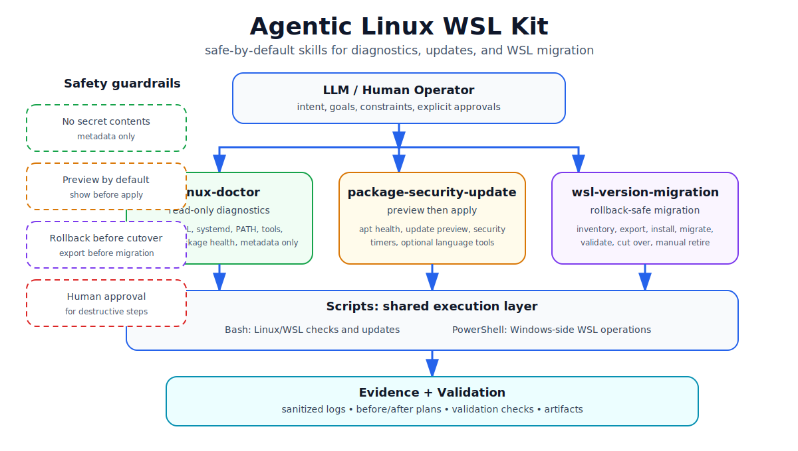

# Aegis Skills

[](#)
[](#)
[](#safety-model)
[](LICENSE)

**Secure automation skills for Linux/WSL and LLM coding-agent workflows.**

Aegis Skills is **not an agent**. It is a set of reusable skills, scripts, wrappers, and SOPs that existing agents or humans can run to keep Linux/WSL environments safer by default.

It helps agents diagnose first, preview risky changes, block unsafe package commands, run approved installs in isolation, and leave behind machine-readable evidence.



## What it does

- **Diagnose Linux/WSL health** with read-only checks.
- **Preview package/security updates** before applying changes.
- **Guide rollback-safe WSL migration** workflows.
- **Run recurring security audits** with structured `summary.json` output.
- **Intercept risky npm/pnpm/yarn/bun/npx commands** and route them through a supply-chain guard.

## Quick start

```bash
git clone https://github.com/zzhang82/agentic-linux-wsl-kit.git
cd agentic-linux-wsl-kit
bash tests/smoke.sh
```

Run a health check:

```bash
bash scripts/linux-doctor.sh
```

Run a security preflight before agent work:

```bash
bash scripts/wsl-security-check.sh --preflight --project .
```

Install package-manager wrappers for active defense:

```bash
mkdir -p ~/.local/bin
ln -sf "$PWD/scripts/safe-npm.sh" ~/.local/bin/npm
ln -sf "$PWD/scripts/safe-npx.sh" ~/.local/bin/npx
ln -sf "$PWD/scripts/safe-pnpm.sh" ~/.local/bin/pnpm
ln -sf "$PWD/scripts/safe-yarn.sh" ~/.local/bin/yarn
ln -sf "$PWD/scripts/safe-bun.sh" ~/.local/bin/bun
```

Then risky commands are blocked:

```bash
npm install axios
```

Expected:

```text
BLOCKED: raw npm install is not allowed in this environment.
```

Use the guard instead:

```bash
bash scripts/node-supply-chain-guard.sh --request "npm install axios" --project .
bash scripts/node-supply-chain-guard.sh --execute-approved npm-ci --project .
bash scripts/node-supply-chain-guard.sh --postinstall-scan --project .
```

## Included skills

```text
linux-doctor
package-security-update
wsl-version-migration
wsl-security-routine
node-supply-chain-guard
```

## Safety model

```text
read-only by default
preview before mutation
explicit approval for risky actions
package installs are intercepted and guard-owned
secrets are never printed
validation produces evidence
```

## More docs

- [Project overview](docs/project-overview.md)
- [Active defense strategy](docs/agent-active-defense.md)
- [npm supply-chain policy](docs/npm-supply-chain-policy.md)
- [Security routine SOP](docs/security-routine-sop.md)
- [Threat model](docs/threat-model.md)
- [Recovery guide](docs/recovery.md)

## Status

MVP1-MVP5 are complete:

```text
MVP1 diagnostics
MVP2 safe package updates
MVP3 WSL migration workflow
MVP4 read-only security routine
MVP5 active package-operation defense
```

Possible next milestone: **MVP6 containerized package quarantine**.

## License

MIT. See [LICENSE](LICENSE).
